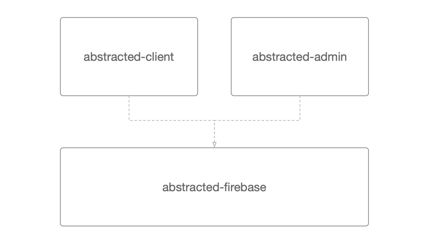

# Abstracted Firebase

> Abstracting Firebase's SDK's for both **client** and **admin** applications

## Installing

If you're using `npm`:

```sh
# Client SDK
npm install --save-dev abstracted-client
# Admin SDK
npm install --save-dev abstracted-admin
```

If you're using `yarn` ... I think you can figure it out.

## What is Abstracted Firebase?

Firebase is an awesome database for getting start fast and _can_ be an awesome database for big projects too. The API is decently documented and the API is "ok" but I continually found myself wrapping little convenience methods around it.

For instance, whether it's reacting to events from the `on()` or getting back one-off's from `once()` I don't really want the "snapshot" I want the `key` and `value`. Also if what I'm pulling down is a _list_ of things I'd rather it come back to as an JS array of things.

```typescript
// Connect to a DB
import DB from 'abstracted-admin';
const db = await DB.connect(config);
// Get a record from DB (with typescript typings)
const user = await db.getValue<User>('users/1234');
// Get a list of records
const user = await db.getList<User[]>('users');
```

There are many more examples in these docs but this section is meant to let you quickly qualify if you give a shit about this package. So in general this library is meant to:

- Provide a set of simplifications for people use the Firebase SDK regularly
- It is lightweight and will not interfere with you using the SDK in any way if you want to drop back to the SDK
- Because this author also created a little mocking library ([`firemock`](https://github.com/forest-fire/firemock)), it is meant to play nicely with firemock when you want to use it.
- This library also plays a foundational role in connecting to Firebase for the [`firemodel`](https://firemodel.info/)
- You can use this abstraction with _both_ the Firebase Client SDK and the Admin SDK

## Abstracted What?

When I first wrote this wrapper I was focusing almost entirely on the backend and therefore the Admin SDK. When I started switching to the frontend I realized I'd missed a trick. In order to not manage to code bases I create the following micro-architecture:



In essence the vast majority of the code is in `abstracted-firebase` but if you're just consuming this library you should just choose between the _admin_ and _client_ SDK's by choosing between the [`abstracted-admin`](https://github.com/forest-fire/abstracted-admin) and [`abstracted-client`](https://github.com/forest-fire/abstracted-client) libraries repectively.

